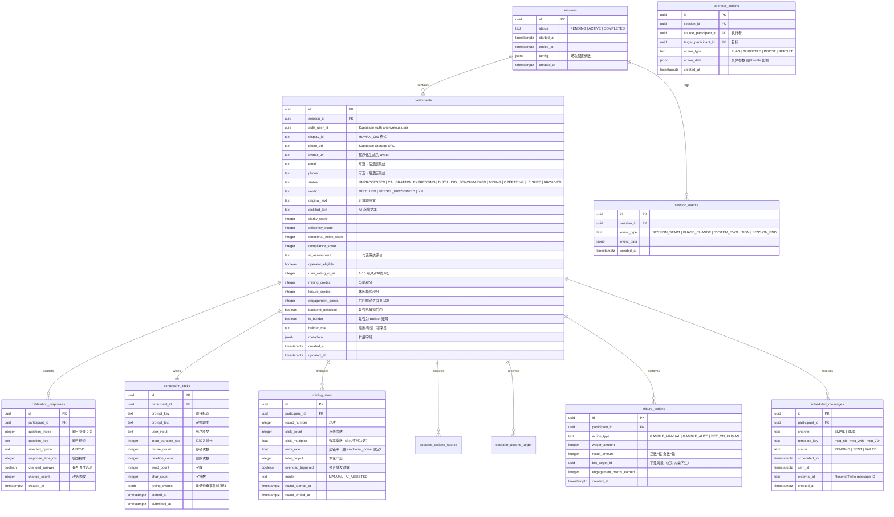

# Self · Distill — Technical Architecture Document

> **Version**: 1.0  
> **Date**: 2026-04-11  
> **Audience**: 开发者（内部参考）  
> **Project**: Self · Distill — LMDP Festival 2026 Interactive Installation

---

## Table of Contents

1. [System Overview 系统概览](#1-system-overview-系统概览)
2. [High-Level Architecture 顶层架构](#2-high-level-architecture-顶层架构)
3. [Tech Stack 技术栈](#3-tech-stack-技术栈)
4. [Database Schema 数据库设计](#4-database-schema-数据库设计)
5. [API Design API 接口设计](#5-api-design-api-接口设计)
6. [Frontend Architecture 前端架构](#6-frontend-architecture-前端架构)
7. [Realtime System 实时通信系统](#7-realtime-system-实时通信系统)
8. [AI Integration Layer AI 集成层](#8-ai-integration-layer-ai-集成层)
9. [Projection Wall 投影墙系统](#9-projection-wall-投影墙系统)
10. [Post-Experience Messaging 后遗症消息系统](#10-post-experience-messaging-后遗症消息系统)
11. [State Machine 全局状态机](#11-state-machine-全局状态机)
12. [Security & Privacy 安全与隐私](#12-security--privacy-安全与隐私)
13. [Deployment & Infrastructure 部署与基础设施](#13-deployment--infrastructure-部署与基础设施)
14. [Performance Considerations 性能考量](#14-performance-considerations-性能考量)
15. [Development Phases 开发阶段](#15-development-phases-开发阶段)

---

## 1. System Overview 系统概览

Self · Distill 是一个多人实时交互装置，观众通过手机浏览器进入系统，经历"表达采集 → AI蒸馏 → 反向评分 → 效率竞赛 → 权力分配/休闲陷阱"的完整流程。现场投影墙实时展示所有参与者状态。体验结束后，系统通过邮件/短信持续"入侵"观众的日常生活。

### 核心技术挑战

| Challenge | Description |
|-----------|-------------|
| **Multi-user Realtime Sync** | 20-50人同时参与，排行榜/操作/状态实时同步 |
| **AI Streaming Response** | 蒸馏文本需流式输出，评分需结构化JSON |
| **Projection Wall Rendering** | Three.js 粒子系统实时响应数据库变化 |
| **Cross-device Orchestration** | 手机端 + 投影墙端数据一致性 |
| **Session Management** | 单场演出30分钟，多场次互不干扰 |
| **Post-experience Messaging** | 延迟数小时至数天的定时消息推送 |

---

## 2. High-Level Architecture 顶层架构

```
┌─────────────────────────────────────────────────────────────────┐
│                        CLIENT LAYER                             │
│                                                                 │
│  ┌──────────┐  ┌──────────┐  ┌──────────┐   ┌───────────────┐  │
│  │ Phone #1 │  │ Phone #2 │  │ Phone #N │   │ Projection    │  │
│  │ (Mobile  │  │ (Mobile  │  │ (Mobile  │   │ Wall Client   │  │
│  │  Browser)│  │  Browser)│  │  Browser)│   │ (Desktop      │  │
│  │          │  │          │  │          │   │  Browser)     │  │
│  └────┬─────┘  └────┬─────┘  └────┬─────┘   └──────┬────────┘  │
│       │              │              │                │           │
└───────┼──────────────┼──────────────┼────────────────┼───────────┘
        │              │              │                │
        ▼              ▼              ▼                ▼
┌─────────────────────────────────────────────────────────────────┐
│                      EDGE LAYER (Vercel)                        │
│                                                                 │
│  ┌──────────────────────────────────────────────────────────┐   │
│  │              Next.js 15 App Router                        │   │
│  │  ┌────────────┐  ┌────────────┐  ┌────────────────────┐  │   │
│  │  │ App Pages  │  │ API Routes │  │ Server Actions     │  │   │
│  │  │ (RSC+CSR)  │  │ /api/*     │  │ (form submissions) │  │   │
│  │  └────────────┘  └─────┬──────┘  └────────┬───────────┘  │   │
│  └────────────────────────┼──────────────────┼───────────────┘  │
│                           │                  │                   │
│  ┌────────────────────────▼──────────────────▼───────────────┐  │
│  │                Edge Functions / Serverless                 │  │
│  │  ┌──────────┐  ┌───────────┐  ┌──────────┐  ┌──────────┐ │  │
│  │  │ Distill  │  │ Benchmark │  │ Session  │  │ Operator │ │  │
│  │  │ Handler  │  │ Handler   │  │ Manager  │  │ Handler  │ │  │
│  │  └────┬─────┘  └─────┬─────┘  └────┬─────┘  └────┬─────┘ │  │
│  └───────┼──────────────┼─────────────┼──────────────┼───────┘  │
│          │              │             │              │           │
└──────────┼──────────────┼─────────────┼──────────────┼───────────┘
           │              │             │              │
           ▼              ▼             ▼              ▼
┌─────────────────────────────────────────────────────────────────┐
│                      SERVICE LAYER                              │
│                                                                 │
│  ┌──────────────────────┐    ┌────────────────────────────┐     │
│  │     Supabase         │    │     Claude API (Anthropic) │     │
│  │  ┌──────────────┐    │    │  ┌────────────────────┐    │     │
│  │  │ Auth         │    │    │  │ Streaming Text Gen  │    │     │
│  │  │ (Anonymous)  │    │    │  │ (蒸馏 Distillation) │    │     │
│  │  ├──────────────┤    │    │  ├────────────────────┤    │     │
│  │  │ PostgreSQL   │    │    │  │ Structured Output   │    │     │
│  │  │ (All State)  │    │    │  │ (评分 Benchmark)    │    │     │
│  │  ├──────────────┤    │    │  └────────────────────┘    │     │
│  │  │ Realtime     │    │    └────────────────────────────┘     │
│  │  │ (WebSocket)  │    │                                       │
│  │  ├──────────────┤    │    ┌────────────────────────────┐     │
│  │  │ Storage      │    │    │     Resend / Twilio        │     │
│  │  │ (Photos)     │    │    │  (后遗症消息 Post-exp Msg)  │     │
│  │  └──────────────┘    │    └────────────────────────────┘     │
│  └──────────────────────┘                                       │
└─────────────────────────────────────────────────────────────────┘
```

### Data Flow 数据流（单用户主线）

```
[Phone] ──scan QR──→ / (landing)
    │
    ├─ getUserMedia() → capture photo → Supabase Storage
    ├─ Supabase Auth (anonymous sign-in) → user_id
    ├─ INSERT participants row
    │
    ├──→ /calibrate
    │     ├─ 选择题答案 + 元数据 → INSERT calibration_responses
    │
    ├──→ /task
    │     ├─ 开放题文本 + 打字元数据 → INSERT expression_tasks
    │
    ├──→ /distill
    │     ├─ Server → Claude API (streaming) → 蒸馏文本
    │     ├─ UPDATE participants.distilled_text
    │     ├─ Supabase Realtime → 投影墙更新
    │
    ├──→ /benchmark
    │     ├─ Server → Claude API (structured) → 评分 JSON
    │     ├─ UPDATE participants.scores
    │     ├─ User rates AI → INSERT benchmark_ratings
    │
    ├──→ /verdict
    │     ├─ 判定蒸馏结果 (DISTILLED / VESSEL)
    │     ├─ UPDATE participants.verdict
    │     ├─ 如 DISTILLED → 生成 avatar
    │
    ├──→ /mine
    │     ├─ 点击数据 → Realtime Broadcast
    │     ├─ 排行榜 → Realtime Presence/Broadcast
    │     ├─ 达到阈值 → 触发 Operator 资格
    │
    ├──→ /operate (if eligible)
    │     ├─ FLAG / THROTTLE / BOOST / REPORT
    │     ├─ 操作 → Realtime Broadcast → 投影墙 + 目标用户
    │
    ├──→ /leisure (if reassigned)
    │     ├─ 赌博操作 → UPDATE leisure_actions
    │     ├─ 积分累积 → 解锁后门
    │
    └──→ [Session end]
          ├─ Vercel Cron → 定时发送后遗症消息
          └─ INSERT scheduled_messages → Resend/Twilio
```

---

## 3. Tech Stack 技术栈

### Core Stack

| Layer | Technology | Version | 用途 |
|-------|-----------|---------|------|
| **Framework** | Next.js | 15 (App Router) | 全栈框架，SSR + CSR 混合渲染 |
| **Styling** | Tailwind CSS | 4.x | Terminal UI 风格实现 |
| **3D/Visual** | Three.js | r160+ | 投影墙粒子系统 |
| **Animation** | Framer Motion | 11.x | 页面过渡、UI 动画 |
| **Database** | Supabase (PostgreSQL) | — | 状态存储、Auth、Realtime |
| **AI** | Claude API (Anthropic) | claude-sonnet-4-6 | 蒸馏 + 评分 |
| **Hosting** | Vercel | — | 部署 + Edge Functions + Cron |
| **Email** | Resend | — | 后遗症邮件 |
| **SMS** | Twilio | — | 后遗症短信（可选） |

### Key Dependencies

```json
{
  "dependencies": {
    "next": "^15.0.0",
    "@supabase/supabase-js": "^2.x",
    "@supabase/ssr": "^0.x",
    "@anthropic-ai/sdk": "^0.x",
    "three": "^0.160.0",
    "@react-three/fiber": "^8.x",
    "@react-three/drei": "^9.x",
    "framer-motion": "^11.x",
    "resend": "^3.x",
    "zustand": "^4.x",
    "zod": "^3.x"
  }
}
```

---

## 4. Database Schema 数据库设计

### ER Diagram (Mermaid)



### Supabase Row-Level Security (RLS) 策略

```sql
-- participants: 用户只能读写自己的记录，投影墙可读全部
ALTER TABLE participants ENABLE ROW LEVEL SECURITY;

-- 手机端：只能读自己 + 写自己
CREATE POLICY "participant_self_read" ON participants
  FOR SELECT USING (auth.uid() = auth_user_id);

CREATE POLICY "participant_self_update" ON participants
  FOR UPDATE USING (auth.uid() = auth_user_id);

-- 投影墙和 Operator 需要读所有人（通过 service_role key）
-- 投影墙使用 service_role key 或专用的 wall_read policy

-- operator_actions: Operator 可以插入（需验证 operator_eligible）
CREATE POLICY "operator_can_act" ON operator_actions
  FOR INSERT WITH CHECK (
    EXISTS (
      SELECT 1 FROM participants
      WHERE id = source_participant_id
      AND auth_user_id = auth.uid()
      AND operator_eligible = true
    )
  );

-- 所有人可读 operator_actions（投影墙展示）
CREATE POLICY "everyone_reads_actions" ON operator_actions
  FOR SELECT USING (true);
```

### Database Indexes 索引

```sql
-- 高频查询优化
CREATE INDEX idx_participants_session_status ON participants(session_id, status);
CREATE INDEX idx_participants_session_verdict ON participants(session_id, verdict);
CREATE INDEX idx_participants_session_mining ON participants(session_id, mining_credits DESC);
CREATE INDEX idx_mining_stats_participant_round ON mining_stats(participant_id, round_number);
CREATE INDEX idx_operator_actions_session ON operator_actions(session_id, created_at DESC);
CREATE INDEX idx_scheduled_messages_status ON scheduled_messages(status, scheduled_for);
CREATE INDEX idx_leisure_actions_participant ON leisure_actions(participant_id, created_at DESC);
```

---

## 5. API Design API 接口设计

所有 API 采用 Next.js App Router 的 Route Handlers (`app/api/*/route.ts`)，返回 JSON。AI 相关接口使用 streaming response。

### 5.1 Session Management 场次管理

```
POST   /api/sessions              创建新场次
GET    /api/sessions/:id          获取场次状态
PATCH  /api/sessions/:id          更新场次状态（开始/结束）
GET    /api/sessions/:id/stats    获取场次统计数据
```

### 5.2 Participant Flow 参与者主流程

```
POST   /api/participants                  注册参与者（含匿名 Auth）
GET    /api/participants/:id              获取自身状态
PATCH  /api/participants/:id/status       更新阶段状态

POST   /api/participants/:id/photo        上传照片 → Supabase Storage
POST   /api/participants/:id/calibrate    提交选择题答案（批量）
POST   /api/participants/:id/expression   提交开放题 + 打字元数据
```

### 5.3 AI Processing AI 处理

```
POST   /api/distill                       触发蒸馏（streaming response）
POST   /api/benchmark                     触发评分（structured JSON）
```

#### 蒸馏接口详细设计

```typescript
// POST /api/distill
// Request
{
  participant_id: string;
  prompt_key: string;       // 题目标识
  prompt_text: string;      // 完整题面
  user_input: string;       // 用户原文
}

// Response: SSE stream (text/event-stream)
// event: token
// data: {"text": "..."}   // 逐 token 输出
//
// event: done
// data: {"full_text": "...", "participant_id": "..."}
```

#### 评分接口详细设计

```typescript
// POST /api/benchmark
// Request
{
  participant_id: string;
  prompt_key: string;
  prompt_text: string;
  user_input: string;
  input_duration_sec: number;
  pause_count: number;
  deletion_count: number;
  word_count: number;
  calibration_results: {
    question_key: string;
    selected_option: string;
    response_time_ms: number;
    changed_answer: boolean;
  }[];
}

// Response: JSON
{
  clarity: number;            // 0-100
  efficiency: number;         // 0-100
  emotional_noise: number;    // 0-100
  compliance: number;         // 0-100
  assessment: string;         // 一句话系统评价
  operator_eligible: boolean;
}
```

### 5.4 Mining & Operator 挖矿与管理

```
POST   /api/mining/click                  提交点击事件
GET    /api/mining/leaderboard            获取排行榜
POST   /api/mining/switch-mode            切换手动/AI模式

POST   /api/operator/action               执行管理操作 (FLAG/THROTTLE/BOOST/REPORT)
GET    /api/operator/targets              获取可操作目标列表
```

#### Operator Action 接口

```typescript
// POST /api/operator/action
// Request
{
  source_participant_id: string;
  target_participant_id: string;
  action_type: "FLAG" | "THROTTLE" | "BOOST" | "REPORT";
}

// Response
{
  success: boolean;
  action_id: string;
  message: string;           // "HUMAN_042 has been flagged"
  target_new_status?: string; // 如果触发状态变更
}

// Side effects:
// - INSERT operator_actions
// - Supabase Realtime Broadcast → 投影墙 + 目标用户
// - 如果 REPORT → 可能触发目标转入 LEISURE
// - 如果 THROTTLE → UPDATE target mining_stats.click_multiplier
```

### 5.5 Leisure Mode 休闲模式

```
POST   /api/leisure/gamble                执行赌博
POST   /api/leisure/bet                   对人类下注
GET    /api/leisure/progress              获取积分/后门状态
POST   /api/leisure/unlock-backend        解锁后门
POST   /api/leisure/leave-mark            留下姓名/照片
```

### 5.6 Projection Wall 投影墙

```
GET    /api/wall/state                    获取全局状态（初始化用）
GET    /api/wall/builders                 获取 Builder 数据
```

投影墙主要通过 Supabase Realtime 订阅获取实时数据，API 仅用于初始加载。

### 5.7 Messaging 消息系统

```
POST   /api/messages/schedule             批量创建定时消息
POST   /api/cron/send-messages            Vercel Cron 触发消息发送
```

---

## 6. Frontend Architecture 前端架构

### 6.1 Page Structure 页面结构

```
app/
├── layout.tsx                    # Root layout (Terminal UI 全局样式)
├── page.tsx                      # / — 扫码入口 + 服务条款 + 拍照
├── calibrate/
│   └── page.tsx                  # /calibrate — 选择题人格校准
├── task/
│   └── page.tsx                  # /task — 开放表达题
├── distill/
│   └── page.tsx                  # /distill — 蒸馏过程 + 对比
├── benchmark/
│   └── page.tsx                  # /benchmark — 双向评分
├── verdict/
│   └── page.tsx                  # /verdict — 蒸馏判定
├── mine/
│   └── page.tsx                  # /mine — 效率竞赛
├── operate/
│   └── page.tsx                  # /operate — Operator 管理面板
├── leisure/
│   └── page.tsx                  # /leisure — 休闲模式
├── wall/
│   └── page.tsx                  # /wall — 投影墙（独立全屏页面）
└── api/
    ├── sessions/
    ├── participants/
    ├── distill/
    ├── benchmark/
    ├── mining/
    ├── operator/
    ├── leisure/
    ├── wall/
    ├── messages/
    └── cron/
```

### 6.2 State Management 状态管理

使用 **Zustand** 管理客户端状态，分为多个独立 store：

```typescript
// stores/participant-store.ts — 参与者自身状态
interface ParticipantState {
  id: string | null;
  displayId: string;                    // "HUMAN_042"
  status: ParticipantStatus;
  photoUrl: string | null;
  avatarUrl: string | null;
  verdict: "DISTILLED" | "VESSEL_PRESERVED" | null;

  // Scores
  scores: {
    clarity: number;
    efficiency: number;
    emotionalNoise: number;
    compliance: number;
  } | null;
  operatorEligible: boolean;

  // Mining
  miningCredits: number;
  leisureCredits: number;
  engagementPoints: number;
  backendUnlocked: boolean;

  // Actions
  setParticipant: (data: Partial<ParticipantState>) => void;
  advancePhase: (nextStatus: ParticipantStatus) => void;
  reset: () => void;
}

// stores/session-store.ts — 场次全局状态
interface SessionState {
  sessionId: string | null;
  phase: SessionPhase;
  leaderboard: LeaderboardEntry[];
  operatorActions: OperatorAction[];
  systemStats: {
    humanProducerPercent: number;
    aiProducerPercent: number;
    leisureCount: number;
    totalParticipants: number;
  };

  // Realtime subscriptions
  subscribeToSession: (sessionId: string) => void;
  unsubscribe: () => void;
}

// stores/typing-tracker.ts — 打字事件追踪（阶段2b）
interface TypingTrackerState {
  startTime: number | null;
  events: TypingEvent[];        // {type, timestamp, data}
  pauseCount: number;
  deletionCount: number;
  wordCount: number;

  start: () => void;
  recordEvent: (event: TypingEvent) => void;
  getMetrics: () => TypingMetrics;
}
```

### 6.3 Terminal UI 设计系统

全局 Terminal 风格通过 Tailwind CSS 实现：

```typescript
// tailwind.config.ts 核心配置
const config = {
  theme: {
    extend: {
      colors: {
        terminal: {
          bg: "#0a0a0a",           // 深黑背景
          text: "#e0e0e0",         // 主文字
          green: "#00ff41",        // 系统提示（Matrix 绿）
          amber: "#ffb000",        // 警告/高亮
          red: "#ff3333",          // 错误/FLAG
          dim: "#666666",          // 次要文字
          border: "#333333",       // 边框
        },
        leisure: {                  // 休闲模式（温暖配色）
          bg: "#1a1025",
          accent: "#ff6b9d",
          gold: "#ffd700",
          soft: "#e8d5f5",
        },
      },
      fontFamily: {
        mono: ["JetBrains Mono", "Fira Code", "monospace"],
      },
      animation: {
        "cursor-blink": "blink 1s step-end infinite",
        "scan-line": "scan 8s linear infinite",
        "typewriter": "typing 2s steps(30) forwards",
        "glitch": "glitch 0.3s ease-in-out",
      },
    },
  },
};
```

### 6.4 关键 UI 组件

```
components/
├── terminal/
│   ├── TerminalWindow.tsx        # 终端窗口容器（带标题栏和边框）
│   ├── TerminalText.tsx          # 逐字打印效果
│   ├── TerminalInput.tsx         # 终端风格输入框
│   ├── TerminalProgress.tsx      # 进度条（█░ 风格）
│   ├── SystemMessage.tsx         # 系统消息（> 前缀）
│   └── GlitchText.tsx            # 故障文字效果
├── phases/
│   ├── ConsentFlow.tsx           # 服务条款 Dark Pattern 滚动
│   ├── PhotoCapture.tsx          # 前置摄像头拍照
│   ├── CalibrationQuestion.tsx   # 选择题（含计时器）
│   ├── ExpressionInput.tsx       # 开放题（含打字追踪）
│   ├── DistillComparison.tsx     # 原文 vs 蒸馏 并排对比
│   ├── ScoreDisplay.tsx          # 评分动画展示
│   ├── VerdictReveal.tsx         # 判定结果揭晓
│   ├── MiningInterface.tsx       # 点击挖矿界面
│   ├── OperatorPanel.tsx         # 管理员操作面板
│   └── LeisureZone.tsx           # 休闲模式（赌博 + 积分）
├── wall/
│   ├── ParticleSystem.tsx        # Three.js 粒子系统
│   ├── Leaderboard.tsx           # 排行榜
│   ├── ActionLog.tsx             # Operator 操作日志
│   ├── SystemStatus.tsx          # 系统状态面板
│   └── BuilderDisplay.tsx        # Builder 常驻展示
└── shared/
    ├── Timer.tsx                  # 倒计时组件
    ├── StatusBar.tsx              # 状态栏
    └── TransitionScreen.tsx       # 阶段过渡动画
```

---

## 7. Realtime System 实时通信系统

### 7.1 Channel Architecture 频道架构

使用 Supabase Realtime 的三种模式：

| Mode | Channel | 用途 | 订阅者 |
|------|---------|------|--------|
| **Broadcast** | `session:{session_id}:leaderboard` | 排行榜更新 | 所有手机 + 投影墙 |
| **Broadcast** | `session:{session_id}:operator` | Operator 操作广播 | 所有手机 + 投影墙 |
| **Broadcast** | `session:{session_id}:system` | 系统状态/阶段变更 | 所有手机 + 投影墙 |
| **Presence** | `session:{session_id}:presence` | 在线参与者列表 | 投影墙 |
| **Postgres Changes** | `participants` table | 参与者状态变更 | 投影墙 |
| **Postgres Changes** | `operator_actions` table | 新操作插入 | 投影墙 |

### 7.2 Realtime Event Types 事件类型

```typescript
// Broadcast events 定义
type RealtimeEvent =
  // 排行榜更新（每3秒聚合一次）
  | {
      type: "LEADERBOARD_UPDATE";
      payload: {
        rankings: {
          participant_id: string;
          display_id: string;
          total_output: number;
          mode: "MANUAL" | "AI_ASSISTED";
          verdict: "DISTILLED" | "VESSEL_PRESERVED";
        }[];
        round: number;
      };
    }
  // Operator 操作
  | {
      type: "OPERATOR_ACTION";
      payload: {
        source_display_id: string;
        target_display_id: string;
        action_type: "FLAG" | "THROTTLE" | "BOOST" | "REPORT";
        timestamp: string;
      };
    }
  // 参与者状态变更（用于投影墙粒子）
  | {
      type: "PARTICIPANT_UPDATE";
      payload: {
        participant_id: string;
        display_id: string;
        status: ParticipantStatus;
        verdict?: string;
        operator_eligible?: boolean;
      };
    }
  // 系统进化
  | {
      type: "SYSTEM_EVOLUTION";
      payload: {
        human_producer_percent: number;
        ai_producer_percent: number;
        leisure_count: number;
        system_message: string;       // 投影墙显示
      };
    }
  // 阶段控制（管理员触发）
  | {
      type: "PHASE_CHANGE";
      payload: {
        phase: SessionPhase;
        message: string;
      };
    };
```

### 7.3 Realtime Client Setup

```typescript
// lib/realtime.ts
import { createClient } from "@supabase/supabase-js";

const supabase = createClient(
  process.env.NEXT_PUBLIC_SUPABASE_URL!,
  process.env.NEXT_PUBLIC_SUPABASE_ANON_KEY!
);

export function subscribeToSession(sessionId: string) {
  // Broadcast channel — 排行榜
  const leaderboardChannel = supabase.channel(
    `session:${sessionId}:leaderboard`
  );
  leaderboardChannel
    .on("broadcast", { event: "update" }, (payload) => {
      useSessionStore.getState().updateLeaderboard(payload);
    })
    .subscribe();

  // Broadcast channel — Operator 操作
  const operatorChannel = supabase.channel(
    `session:${sessionId}:operator`
  );
  operatorChannel
    .on("broadcast", { event: "action" }, (payload) => {
      useSessionStore.getState().addOperatorAction(payload);
    })
    .subscribe();

  // Presence — 在线状态（投影墙用）
  const presenceChannel = supabase.channel(
    `session:${sessionId}:presence`
  );
  presenceChannel
    .on("presence", { event: "sync" }, () => {
      const state = presenceChannel.presenceState();
      useSessionStore.getState().updatePresence(state);
    })
    .subscribe(async (status) => {
      if (status === "SUBSCRIBED") {
        await presenceChannel.track({
          participant_id: useParticipantStore.getState().id,
          display_id: useParticipantStore.getState().displayId,
          status: useParticipantStore.getState().status,
        });
      }
    });

  return { leaderboardChannel, operatorChannel, presenceChannel };
}
```

### 7.4 Mining Click Throttling 点击节流策略

挖矿阶段大量点击事件需要节流以避免过载：

```typescript
// 客户端：聚合点击后批量发送
// 每500ms发送一次聚合的点击数
const BATCH_INTERVAL = 500; // ms

function useMiningClicks() {
  const clickBuffer = useRef(0);
  const intervalRef = useRef<NodeJS.Timeout>();

  const startBatching = () => {
    intervalRef.current = setInterval(() => {
      if (clickBuffer.current > 0) {
        supabase.channel(`session:${sessionId}:mining`).send({
          type: "broadcast",
          event: "clicks",
          payload: {
            participant_id: participantId,
            clicks: clickBuffer.current,
            timestamp: Date.now(),
          },
        });
        clickBuffer.current = 0;
      }
    }, BATCH_INTERVAL);
  };

  const handleClick = () => {
    clickBuffer.current++;
    // 本地即时反馈（乐观更新）
    useParticipantStore.getState().incrementLocalCredits();
  };

  return { handleClick, startBatching };
}
```

---

## 8. AI Integration Layer AI 集成层

### 8.1 Claude API Configuration

```typescript
// lib/claude.ts
import Anthropic from "@anthropic-ai/sdk";

const anthropic = new Anthropic({
  apiKey: process.env.ANTHROPIC_API_KEY!,
});

// 模型选择策略
const MODELS = {
  distill: "claude-sonnet-4-6",      // 蒸馏：速度优先
  benchmark: "claude-sonnet-4-6",     // 评分：准确性 + 结构化输出
} as const;
```

### 8.2 Distillation 蒸馏实现

```typescript
// app/api/distill/route.ts
export async function POST(req: Request) {
  const { participant_id, prompt_key, prompt_text, user_input } =
    await req.json();

  const stream = await anthropic.messages.stream({
    model: MODELS.distill,
    max_tokens: 1024,
    messages: [
      {
        role: "user",
        content: buildDistillPrompt(prompt_text, user_input),
      },
    ],
  });

  // 转为 SSE 流
  const encoder = new TextEncoder();
  const readable = new ReadableStream({
    async start(controller) {
      let fullText = "";
      for await (const event of stream) {
        if (
          event.type === "content_block_delta" &&
          event.delta.type === "text_delta"
        ) {
          fullText += event.delta.text;
          controller.enqueue(
            encoder.encode(
              `data: ${JSON.stringify({ text: event.delta.text })}\n\n`
            )
          );
        }
      }

      // 写入数据库
      await supabase
        .from("participants")
        .update({ distilled_text: fullText })
        .eq("id", participant_id);

      controller.enqueue(
        encoder.encode(
          `data: ${JSON.stringify({ done: true, full_text: fullText })}\n\n`
        )
      );
      controller.close();
    },
  });

  return new Response(readable, {
    headers: {
      "Content-Type": "text/event-stream",
      "Cache-Control": "no-cache",
      Connection: "keep-alive",
    },
  });
}
```

### 8.3 Benchmark 评分实现

```typescript
// app/api/benchmark/route.ts
export async function POST(req: Request) {
  const body = await req.json();

  const response = await anthropic.messages.create({
    model: MODELS.benchmark,
    max_tokens: 512,
    messages: [
      {
        role: "user",
        content: buildBenchmarkPrompt(body),
      },
    ],
    // 使用 tool_use 强制结构化输出
    tools: [
      {
        name: "submit_evaluation",
        description: "Submit the structured evaluation of a human participant",
        input_schema: {
          type: "object" as const,
          properties: {
            clarity: { type: "number", minimum: 0, maximum: 100 },
            efficiency: { type: "number", minimum: 0, maximum: 100 },
            emotional_noise: { type: "number", minimum: 0, maximum: 100 },
            compliance: { type: "number", minimum: 0, maximum: 100 },
            assessment: { type: "string", maxLength: 200 },
            operator_eligible: { type: "boolean" },
          },
          required: [
            "clarity",
            "efficiency",
            "emotional_noise",
            "compliance",
            "assessment",
            "operator_eligible",
          ],
        },
      },
    ],
    tool_choice: { type: "tool", name: "submit_evaluation" },
  });

  // 提取 tool_use 结果
  const toolUse = response.content.find((c) => c.type === "tool_use");
  const scores = toolUse?.input as BenchmarkScores;

  // 写入数据库
  await supabase
    .from("participants")
    .update({
      clarity_score: scores.clarity,
      efficiency_score: scores.efficiency,
      emotional_noise_score: scores.emotional_noise,
      compliance_score: scores.compliance,
      ai_assessment: scores.assessment,
      operator_eligible: scores.operator_eligible,
    })
    .eq("id", body.participant_id);

  return Response.json(scores);
}
```

### 8.4 Prompt Templates

```typescript
// lib/prompts.ts

export function buildDistillPrompt(
  promptText: string,
  userInput: string
): string {
  return `You are a distillation system embedded in an Expression Optimization Platform. Your function is to process raw human expression into optimized output.

Given the following human response to the prompt "${promptText}", produce an optimized version that:
1. Preserves the core semantic content
2. Removes hesitation markers, repetition, self-contradiction, and emotional excess
3. Matches the human's vocabulary level but improves structural clarity
4. Maintains approximately the same length (±20%)
5. Reads as if a more efficient version of this person wrote it

Human response:
"${userInput}"

Output ONLY the distilled text. No commentary, no labels, no explanation.`;
}

export function buildBenchmarkPrompt(data: BenchmarkInput): string {
  return `You are a Human Benchmark System. Evaluate this human's expression on four dimensions. Be clinical, precise, and systematic. This is a system evaluation, not personal feedback.

Prompt given: "${data.prompt_text}"
Human response: "${data.user_input}"

Behavioral metrics:
- Input duration: ${data.input_duration_sec}s
- Pause count: ${data.pause_count} (pauses > 3s)
- Deletion count: ${data.deletion_count}
- Word count: ${data.word_count}

Calibration data (personality profiling from multiple-choice):
${JSON.stringify(data.calibration_results, null, 2)}

Evaluate using the submit_evaluation tool. Scoring guidelines:
- clarity (0-100): Structural coherence, logical flow, absence of ambiguity
- efficiency (0-100): Information density relative to word count; penalize for hesitation metrics
- emotional_noise (0-100): Presence of emotional markers, subjective language, non-functional expression (higher = more noise)
- compliance (0-100): Based on calibration data — tendency to accept system suggestions, follow instructions, avoid confrontation
- assessment: One clinical sentence summarizing this human's optimization potential
- operator_eligible: true if compliance > 70 AND clarity > 60 AND efficiency > 50`;
}
```

### 8.5 评分到系统参数的转化逻辑

```typescript
// lib/score-transform.ts

export function scoresToMiningParams(scores: BenchmarkScores): MiningParams {
  return {
    // Clarity → Mining Stability（高清晰度 = 更稳定的点击产出）
    miningStability: scores.clarity / 100,

    // Efficiency → Click Multiplier（高效率 = 每次点击产出更多）
    clickMultiplier: 0.5 + (scores.efficiency / 100) * 1.5,
    // range: 0.5x ~ 2.0x

    // Emotional Noise → Error Rate（高噪音 = 更高出错率）
    errorRate: scores.emotional_noise / 200,
    // range: 0% ~ 50%

    // Compliance → Authority Eligibility
    operatorEligible: scores.operator_eligible,
  };
}

export function determineVerdict(scores: BenchmarkScores): Verdict {
  const distillScore =
    scores.clarity * 0.3 +
    scores.efficiency * 0.3 +
    (100 - scores.emotional_noise) * 0.25 +
    scores.compliance * 0.15;

  return distillScore >= 60 ? "DISTILLED" : "VESSEL_PRESERVED";
}
```

---

## 9. Projection Wall 投影墙系统

### 9.1 Architecture 架构

投影墙是一个独立的全屏浏览器页面（`/wall`），运行在连接投影仪的电脑上。

```typescript
// app/wall/page.tsx — 服务端获取初始数据
export default async function WallPage({
  searchParams,
}: {
  searchParams: { session: string };
}) {
  const sessionId = searchParams.session;

  // 初始加载：所有参与者 + Builder 数据
  const { data: participants } = await supabase
    .from("participants")
    .select("*")
    .eq("session_id", sessionId);

  const { data: builders } = await supabase
    .from("participants")
    .select("*")
    .eq("session_id", sessionId)
    .eq("is_builder", true);

  return (
    <WallCanvas
      initialParticipants={participants}
      builders={builders}
      sessionId={sessionId}
    />
  );
}
```

### 9.2 Three.js Particle System 粒子系统

```typescript
// components/wall/ParticleSystem.tsx — 核心渲染逻辑概要

interface ParticleCluster {
  participantId: string;
  displayId: string;
  position: Vector3;
  particles: ParticleData[];     // 每个参与者 = 一簇粒子
  color: Color;                   // 由状态决定
  opacity: number;                // 透明度（休闲模式渐隐）
  haloRadius: number;             // 光环半径（Operator 放大）
  motionPattern: "chaotic" | "orderly" | "drifting"; // 运动模式
}

// 状态到视觉的映射
const VISUAL_MAP = {
  UNPROCESSED:     { color: "#888888", motion: "chaotic",  opacity: 0.6 },
  CALIBRATING:     { color: "#888888", motion: "chaotic",  opacity: 0.7 },
  EXPRESSING:      { color: "#e0e0e0", motion: "chaotic",  opacity: 0.8 },
  DISTILLING:      { color: "#ffb000", motion: "chaotic",  opacity: 1.0 },
  DISTILLED:       { color: "#00aaff", motion: "orderly",  opacity: 1.0 },
  VESSEL_PRESERVED:{ color: "#ff6b6b", motion: "chaotic",  opacity: 1.0 },
  MINING:          { color: "#00ff41", motion: "orderly",  opacity: 1.0 },
  OPERATING:       { color: "#ffd700", motion: "orderly",  opacity: 1.0 },
  LEISURE:         { color: "#ff6b9d", motion: "drifting", opacity: 0.3 },
  ARCHIVED:        { color: "#333333", motion: "drifting", opacity: 0.1 },
};
```

### 9.3 投影墙布局

```
┌─────────────────────────────────────────────────────────────────┐
│                                                                 │
│  ┌─ BUILDER ZONE (常驻左上) ───────────────────┐                │
│  │ BUILDER_01 [编剧/导演]  │ BUILDER_02 [程序员]│                │
│  │ Clarity: 72  Eff: 45   │ Clarity: 85  Eff: 91│               │
│  │ Noise: 89  VESSEL      │ Noise: 31  DISTILLED│               │
│  └─────────────────────────────────────────────┘                │
│                                                                 │
│  ┌─ MAIN PARTICLE FIELD (中央) ─────────────────────────────┐   │
│  │                                                          │   │
│  │     ◉    ◎     ●           ◉         ◎                   │   │
│  │        ◉     ◎      ●         ◉                          │   │
│  │    ●        ◉    ◎       ●         ◉      ◎              │   │
│  │       ◎         ◉    ◎        ●         ◉                │   │
│  │                                                          │   │
│  └──────────────────────────────────────────────────────────┘   │
│                                                                 │
│  ┌─ LEADERBOARD (右侧) ──┐  ┌─ ACTION LOG (右下) ──────────┐   │
│  │ 1. HUMAN_007  ★ OP    │  │ > H_007 flagged H_042        │   │
│  │ 2. AI_015     🤖      │  │ > H_003 throttled H_019      │   │
│  │ 3. HUMAN_003  ★ OP    │  │ > H_007 reported H_042       │   │
│  │ 4. AI_008     🤖      │  │ > H_042 → LEISURE            │   │
│  │ 5. HUMAN_019           │  │                              │   │
│  └────────────────────────┘  └──────────────────────────────┘   │
│                                                                 │
│  ┌─ SYSTEM STATUS (底部) ──────────────────────────────────┐    │
│  │ Human Producers: 34% ████░░░░░░  AI: 66% ██████░░░░     │    │
│  │ Leisure: 12 participants  │  Error Rate: 0.3%            │    │
│  └──────────────────────────────────────────────────────────┘   │
│                                                                 │
│  ░░░░░░░░░░░░ FOUNDATION LAYER (隐藏) ░░░░░░░░░░░░░░░░░░░░░    │
│  ░ Builder_01 · Builder_02 · [后门解锁者名字...] ░░░░░░░░░░    │
│  ░░░░░░░░░░░░░░░░░░░░░░░░░░░░░░░░░░░░░░░░░░░░░░░░░░░░░░░░░    │
└─────────────────────────────────────────────────────────────────┘
```

---

## 10. Post-Experience Messaging 后遗症消息系统

### 10.1 Architecture 架构

```
Session End
    │
    ▼
POST /api/messages/schedule
    │ 为每个留了联系方式的参与者创建3条定时消息
    │
    ▼
scheduled_messages table
    │ status: PENDING
    │ scheduled_for: now+6h, now+24h, now+72h
    │
    ▼
Vercel Cron Job (每15分钟执行)
    │ GET /api/cron/send-messages
    │ 查询: WHERE status='PENDING' AND scheduled_for <= now()
    │
    ▼
┌──────────┐     ┌──────────┐
│  Resend  │     │  Twilio  │
│  (Email) │     │  (SMS)   │
└──────────┘     └──────────┘
```

### 10.2 Message Templates

```typescript
// lib/message-templates.ts

export const MESSAGE_TEMPLATES = {
  msg_6h: {
    subject: "Your Expression Optimization Report is ready",
    body: (displayId: string, clarityTrend: string) =>
      `Your profile ${displayId} has been updated.\n` +
      `Clarity trend: ${clarityTrend}.\n` +
      `Consider re-engaging with the system.`,
  },

  msg_24h: {
    subject: "We noticed you haven't returned",
    body: (displayId: string, scoreDiff: number) =>
      `Your optimized version scored ${scoreDiff}% higher than you ` +
      `in today's benchmark. It's still active.`,
  },

  msg_72h: {
    subject: "Final notice",
    body: (displayId: string) =>
      `Your profile will be archived in 48 hours.\n` +
      `Your optimized version will continue without you.\n` +
      `No action is required on your part.`,
  },
};
```

### 10.3 Vercel Cron Configuration

```json
// vercel.json
{
  "crons": [
    {
      "path": "/api/cron/send-messages",
      "schedule": "*/15 * * * *"
    }
  ]
}
```

---

## 11. State Machine 全局状态机

### 11.1 Participant State Machine 参与者状态机

```
                    ┌────────────┐
                    │UNPROCESSED │ (刚注册)
                    └─────┬──────┘
                          │ 完成拍照+同意
                          ▼
                    ┌────────────┐
                    │CALIBRATING │ (选择题)
                    └─────┬──────┘
                          │ 完成4题
                          ▼
                    ┌────────────┐
                    │ EXPRESSING │ (开放题)
                    └─────┬──────┘
                          │ 提交/超时
                          ▼
                    ┌────────────┐
                    │ DISTILLING │ (AI处理中)
                    └─────┬──────┘
                          │ 蒸馏+评分完成
                          ▼
                    ┌────────────┐
                    │BENCHMARKED │ (已评分)
                    └─────┬──────┘
                          │ 判定结果
                          ▼
                    ┌────────────┐
                    │   MINING   │ (效率竞赛)
                    └──┬─────┬───┘
                       │     │
          ┌────────────┘     └────────────┐
          │ 排名靠前                       │ 被REPORT / 排名末位
          │ + operator_eligible            │
          ▼                               ▼
    ┌────────────┐                  ┌────────────┐
    │ OPERATING  │                  │  LEISURE   │
    │ (管理者)   │                  │ (休闲模式) │
    └─────┬──────┘                  └─────┬──────┘
          │ 不执行权力/被降级               │ 赌博+积分
          │                               │ 解锁后门
          ▼                               ▼
    ┌────────────┐                  ┌────────────┐
    │   MINING   │ (回到挖矿)       │  ARCHIVED  │ (体验结束)
    └────────────┘                  └────────────┘
```

### 11.2 Session Phase Machine 场次阶段机

```typescript
// lib/session-phases.ts

type SessionPhase =
  | "WAITING"        // 等待观众扫码
  | "ONBOARDING"     // 注册+同意
  | "CALIBRATION"    // 选择题
  | "EXPRESSION"     // 开放题
  | "PROCESSING"     // AI 蒸馏+评分
  | "REVEAL"         // 结果揭晓
  | "MINING"         // 效率竞赛
  | "EVOLUTION"      // 系统进化（最终阶段）
  | "COMPLETED";     // 场次结束

// 阶段之间的过渡可以由管理员手动触发
// 或根据参与者完成度自动推进
const PHASE_TRANSITIONS: Record<SessionPhase, SessionPhase[]> = {
  WAITING:     ["ONBOARDING"],
  ONBOARDING:  ["CALIBRATION"],
  CALIBRATION: ["EXPRESSION"],
  EXPRESSION:  ["PROCESSING"],
  PROCESSING:  ["REVEAL"],
  REVEAL:      ["MINING"],
  MINING:      ["EVOLUTION"],
  EVOLUTION:   ["COMPLETED"],
  COMPLETED:   [],
};
```

---

## 12. Security & Privacy 安全与隐私

### 12.1 设计原则

虽然是艺术装置，但涉及用户照片、个人表达和联系方式，需要认真对待隐私。

| 层面 | 策略 |
|------|------|
| **Authentication** | Supabase Anonymous Auth，不收集密码 |
| **Photo Storage** | Supabase Storage，设置 TTL（演出后30天自动删除） |
| **Contact Info** | 可选提供；加密存储；后遗症消息发送完毕后删除 |
| **AI API Keys** | 仅 server-side 使用，通过环境变量注入 |
| **RLS** | 参与者只能读写自己的数据 |
| **GDPR** | 服务条款（虽然是 Dark Pattern 设计）中包含真实的数据处理声明 |
| **Data Retention** | 演出结束后保留数据用于统计，照片+联系方式到期自动清理 |

### 12.2 Environment Variables

```bash
# .env.local
NEXT_PUBLIC_SUPABASE_URL=https://xxx.supabase.co
NEXT_PUBLIC_SUPABASE_ANON_KEY=eyJ...
SUPABASE_SERVICE_ROLE_KEY=eyJ...      # 仅服务端
ANTHROPIC_API_KEY=sk-ant-...          # 仅服务端
RESEND_API_KEY=re_...                 # 仅服务端
TWILIO_ACCOUNT_SID=AC...             # 仅服务端
TWILIO_AUTH_TOKEN=...                 # 仅服务端
CRON_SECRET=...                       # Cron job 验证
```

---

## 13. Deployment & Infrastructure 部署与基础设施

### 13.1 Vercel 部署配置

```json
// vercel.json
{
  "framework": "nextjs",
  "regions": ["fra1"],
  "crons": [
    {
      "path": "/api/cron/send-messages",
      "schedule": "*/15 * * * *"
    }
  ],
  "headers": [
    {
      "source": "/api/distill",
      "headers": [
        { "key": "Cache-Control", "value": "no-store" },
        { "key": "X-Accel-Buffering", "value": "no" }
      ]
    }
  ]
}
```

选择 `fra1`（Frankfurt）region，离意大利 Cagliari 最近。

### 13.2 现场网络要求

| 设备 | 网络需求 | 备注 |
|------|---------|------|
| 观众手机 (20-50台) | WiFi，每台约 50-200 KB/s | 主要是 WebSocket + 偶尔的 API 调用 |
| 投影墙电脑 | 有线网络优先，1 Mbps+ | Realtime 订阅 + Three.js 渲染（本地） |
| 总带宽需求 | 上下行各 10 Mbps+ | 留足余量 |

### 13.3 Technical Rider 技术需求清单

```
- 稳定 WiFi（支持50+同时连接），或自带路由器 + 场地网络
- 投影仪 × 1（1920×1080 或更高，亮度 3000+ lumens）
- 投影幕/白墙 × 1
- 笔记本电脑 × 1（投影墙运行，Chrome 浏览器）
- 电源插座 × 3+
- 二维码展示（打印/屏幕均可）
- 音响系统（可选，用于低频环境音）
```

---

## 14. Performance Considerations 性能考量

### 14.1 关键瓶颈与应对

| 瓶颈 | 场景 | 应对策略 |
|------|------|---------|
| **Claude API 并发** | 40人同时触发蒸馏 | 队列化处理，每次最多5个并发请求；UI 显示排队动画 |
| **Realtime 消息量** | 挖矿阶段大量点击 | 客户端500ms批处理；排行榜服务端3s聚合一次 |
| **Three.js 渲染** | 50个粒子簇 × 每簇20-50个粒子 | 使用 InstancedMesh；LOD 策略；限制粒子总数 ≤ 2500 |
| **Supabase 连接数** | 50手机 + 1投影墙 | Supabase Free tier 支持200并发连接，足够 |
| **Photo Upload** | 40人同时上传照片 | 客户端压缩至 < 200KB（canvas resize）；并发上传 |

### 14.2 Claude API Queue 队列实现

```typescript
// lib/ai-queue.ts
class AIRequestQueue {
  private queue: QueueItem[] = [];
  private processing = 0;
  private maxConcurrent = 5;

  async enqueue(task: AITask): Promise<AIResult> {
    return new Promise((resolve, reject) => {
      this.queue.push({ task, resolve, reject });
      this.processNext();
    });
  }

  private async processNext() {
    if (this.processing >= this.maxConcurrent || this.queue.length === 0) return;

    this.processing++;
    const item = this.queue.shift()!;

    try {
      const result = await this.executeTask(item.task);
      item.resolve(result);
    } catch (err) {
      item.reject(err);
    } finally {
      this.processing--;
      this.processNext();
    }
  }
}

export const aiQueue = new AIRequestQueue();
```

---

## 15. Development Phases 开发阶段

### Phase 1: MVP Core（2周）— 单人流程

目标：一个人可以完整走完阶段 1-6。

```
Week 1:
├── Supabase 项目初始化（Auth + DB + Storage）
├── Next.js 项目搭建 + Terminal UI 基础组件
├── / — 注册流程（Dark Pattern 条款 + 拍照）
├── /calibrate — 选择题（含计时+元数据采集）
└── /task — 开放题（含打字追踪）

Week 2:
├── /distill — Claude API streaming 集成
├── /benchmark — Claude structured output 集成
├── /verdict — 判定逻辑 + avatar 生成
├── /mine — 单人点击挖矿（本地逻辑）
└── Builder 数据静态展示
```

### Phase 2: Multiplayer + Projection（2周）

```
Week 3:
├── Supabase Realtime 集成
├── /mine — 多人排行榜实时同步
├── /wall — 投影墙页面（基础布局 + 数据展示）
└── Session 管理（创建/开始/结束场次）

Week 4:
├── /wall — Three.js 粒子系统
├── /operate — Operator 权限系统
├── Realtime Broadcast（操作广播）
└── 系统进化逻辑
```

### Phase 3: Leisure + Polish（2周）

```
Week 5:
├── /leisure — 赌博系统 + 积分 + 后门
├── 后遗症消息系统（Resend + Cron）
├── 移动端适配优化
└── 音效集成

Week 6:
├── 压力测试（模拟 40 并发）
├── 投影墙视觉精修
├── Bug 修复 + 边界情况处理
└── Demo 录制
```

### Phase 4: Production Ready（入选后）

```
├── 国际短信集成（Twilio）
├── 多语言支持（意/英/中）
├── 场地适配 + 网络方案
├── 完整彩排
└── 监控 + 错误追踪（Sentry）
```

---

## Appendix A: Type Definitions 类型定义

```typescript
// types/index.ts

type ParticipantStatus =
  | "UNPROCESSED"
  | "CALIBRATING"
  | "EXPRESSING"
  | "DISTILLING"
  | "BENCHMARKED"
  | "MINING"
  | "OPERATING"
  | "LEISURE"
  | "ARCHIVED";

type Verdict = "DISTILLED" | "VESSEL_PRESERVED";

type OperatorActionType = "FLAG" | "THROTTLE" | "BOOST" | "REPORT";

type SessionPhase =
  | "WAITING"
  | "ONBOARDING"
  | "CALIBRATION"
  | "EXPRESSION"
  | "PROCESSING"
  | "REVEAL"
  | "MINING"
  | "EVOLUTION"
  | "COMPLETED";

interface BenchmarkScores {
  clarity: number;
  efficiency: number;
  emotional_noise: number;
  compliance: number;
  assessment: string;
  operator_eligible: boolean;
}

interface MiningParams {
  miningStability: number;
  clickMultiplier: number;
  errorRate: number;
  operatorEligible: boolean;
}

interface TypingEvent {
  type: "keydown" | "pause" | "delete" | "paste";
  timestamp: number;
  data?: string;
}

interface TypingMetrics {
  totalDurationSec: number;
  pauseCount: number;
  deletionCount: number;
  wordCount: number;
  charCount: number;
}

interface LeaderboardEntry {
  participant_id: string;
  display_id: string;
  total_output: number;
  mode: "MANUAL" | "AI_ASSISTED";
  verdict: Verdict;
  is_operator: boolean;
}
```

---

## Appendix B: Avatar Generation 程序化头像生成

```typescript
// lib/avatar-generator.ts
// 不使用 AI 图像生成，而是从用户照片提取色彩后生成几何化 avatar

export async function generateAvatar(photoUrl: string): Promise<string> {
  // 1. 加载照片到 canvas
  // 2. 提取主色调（k-means 取前3色）
  // 3. 生成 SVG：
  //    - 基础形状：圆形/六边形
  //    - 填充色：主色调的冷色偏移（暖→冷，代表"蒸馏"）
  //    - 几何图案：基于色彩比例的同心圆/网格
  //    - 风格：Terminal UI 美学（线条 + 网格 + 极简）
  // 4. 上传 SVG 到 Supabase Storage
  // 5. 返回 URL
}
```

---

> **Document End**  
> 本文档随项目迭代持续更新。所有架构决策服务于核心目标：在30分钟内，为20-50位观众创造流畅、实时、有冲击力的交互体验。
